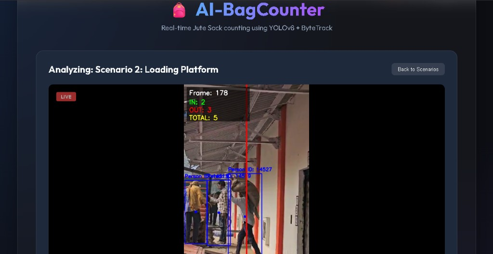

# AI-BagCounter 

[](https://opensource.org/licenses/MIT)
[](https://www.python.org/downloads/)
[](https://github.com/ultralytics/ultralytics)

AI-powered jute sack counting system for warehouse logistics using YOLOv8 + ByteTrack.

## 🖼️ Web Dashboard Preview



## 📌 Problem Statement
In grain warehouses (mandis), manual counting of jute sacks during truck unloading is labor-intensive and error-prone. This system automates the process by detecting bags and associating them with workers.

## 🎯 Features
- **Outbound Bag Counting**: Focuses on counting bags being loaded into trucks.
- **Worker Association**: Automatically associates bags with workers to improve counting accuracy.
- **Web Dashboard**: Real-time processed video streaming via Flask.
- **Batch Processing**: Easily run analysis on multiple videos at once.

## 🧠 How It Works
The system follows a multi-stage computer vision pipeline:

```
Video Frame → YOLO Detection (Person & Bags) → Person-Bag Association → Line Crossing Check (Bags Only) → Count Update → Annotated Output
```

1. **Detection**: YOLOv8 detects both people and various bag-like objects (backpacks, handbags, suitcases).
2. **Association**: A proximity-based algorithm checks which bags are being carried by which person.
3. **Visualization**: Workers are highlighted in green if they have a bag, blue otherwise.
4. **Counting**: The system only tracks the crossing of *bags* across the virtual line to ensure accurate inventory counting.

## 📁 Project Structure
```
AI-BagCounter/
├── config/             # Scenario-specific configuration files
├── src/                # Core source code (tracking, counting, visualization)
├── scripts/            # CLI tools and batch processors
├── data/               # Input videos and samples
├── webapp/             # Flask-based web dashboard
├── tests/              # Unit tests
├── docs/               # Technical documentation
└── assets/             # Branding and static media
```

## ⚙️ Installation
1. Clone the repository:
   ```bash
   git clone https://github.com/yourusername/AI-BagCounter.git
   cd AI-BagCounter
   ```
2. Install dependencies:
   ```bash
   pip install -r requirements.txt
   ```

## ▶️ Usage
### Single Video Run
```bash
python scripts/main.py --video data/samples/scenario1.mp4 --config config/scenario1_config.yaml
```

### Batch Run
```bash
python scripts/run_all_scenarios.py
```

### Web Dashboard
1. Start the Flask server:
   ```bash
   python webapp/flask_server.py
   ```
2. Open your browser and navigate to `http://localhost:8000`.

## 📄 License
This project is licensed under the MIT License - see the [LICENSE](LICENSE) file for details.
