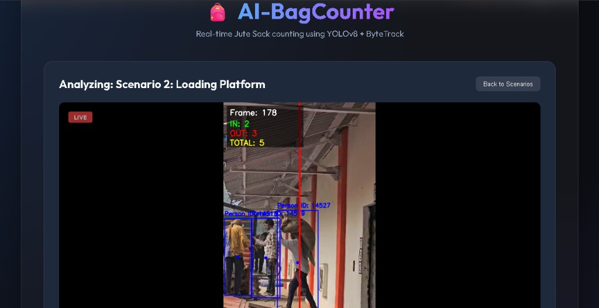
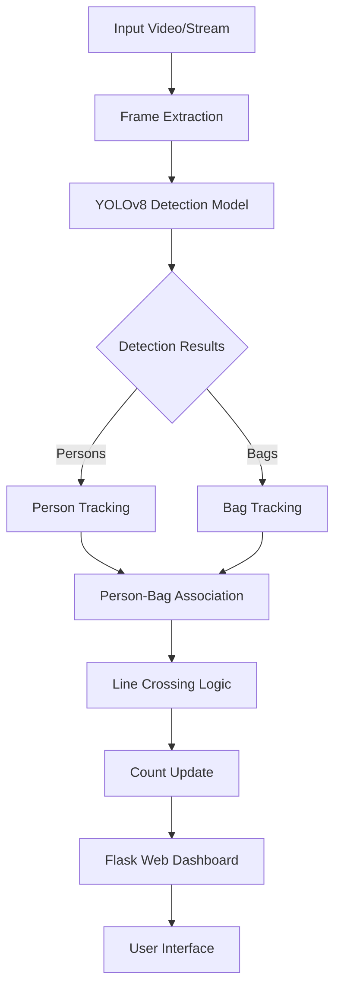
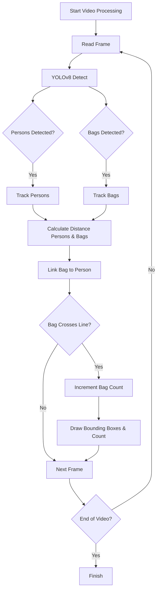

# AI-BagCounter 

[](https://opensource.org/licenses/MIT)
[](https://www.python.org/downloads/)
[](https://github.com/ultralytics/ultralytics)

AI-powered jute sack counting system for warehouse logistics using YOLOv8 + ByteTrack.

## 🖼️ Web Dashboard Preview



## 🎬 Demo


*(Placeholder: Add your demo GIF in the assets folder)*

## 📌 Problem Statement
In grain warehouses (mandis), manual counting of jute sacks during truck unloading is labor-intensive and error-prone. This system automates the process by detecting bags and associating them with workers.

## 🎯 Features
- **Outbound Bag Counting**: Focuses on counting bags being loaded into trucks.
- **Worker Association**: Automatically associates bags with workers to improve counting accuracy.
- **Web Dashboard**: Real-time processed video streaming via Flask.
- **Batch Processing**: Easily run analysis on multiple videos at once.

## 🧠 How It Works
The system follows a multi-stage computer vision pipeline:

```
Video Frame → YOLO Detection (Person & Bags) → Person-Bag Association → Line Crossing Check (Bags Only) → Count Update → Annotated Output
```

1. **Detection**: YOLOv8 detects both people and various bag-like objects (backpacks, handbags, suitcases).
2. **Association**: A proximity-based algorithm checks which bags are being carried by which person.
3. **Visualization**: Workers are highlighted in green if they have a bag, blue otherwise.
4. **Counting**: The system only tracks the crossing of *bags* across the virtual line to ensure accurate inventory counting.

## 🏗️ Architecture


```mermaid
graph TD
    A[Input Video/Stream] --> B[Frame Extraction]
    B --> C[YOLOv8 Detection Model]
    C --> D{Detection Results}
    D -->|Persons| E[Person Tracking]
    D -->|Bags| F[Bag Tracking]
    E --> G[Person-Bag Association]
    F --> G
    G --> H[Line Crossing Logic]
    H --> I[Count Update]
    I --> J[Flask Web Dashboard]
    J --> K[User Interface]
```

## 🔄 Process Flowchart


```mermaid
flowchart TD
    Start[Start Video Processing] --> ReadFrame[Read Frame]
    ReadFrame --> Detect[YOLOv8 Detect]
    Detect --> CheckPersons{Persons Detected?}
    Detect --> CheckBags{Bags Detected?}
    CheckPersons -->|Yes| TrackPersons[Track Persons]
    CheckBags -->|Yes| TrackBags[Track Bags]
    TrackPersons --> Associate[Calculate Distance Persons & Bags]
    TrackBags --> Associate
    Associate --> Link[Link Bag to Person]
    Link --> Cross{Bag Crosses Line?}
    Cross -->|Yes| UpdateCount[Increment Bag Count]
    Cross -->|No| NextFrame
    UpdateCount --> Draw[Draw Bounding Boxes & Count]
    Draw --> NextFrame[Next Frame]
    NextFrame --> EndCheck{End of Video?}
    EndCheck -->|No| ReadFrame
    EndCheck -->|Yes| End[Finish]
```

## 📁 Project Structure
```
AI-BagCounter/
├── config/             # Scenario-specific configuration files
├── src/                # Core source code (tracking, counting, visualization)
├── scripts/            # CLI tools and batch processors
├── data/               # Input videos and samples
├── webapp/             # Flask-based web dashboard
├── tests/              # Unit tests
├── docs/               # Technical documentation
└── assets/             # Branding and static media
```

## ⚙️ Installation
1. Clone the repository:
   ```bash
   git clone https://github.com/yourusername/AI-BagCounter.git
   cd AI-BagCounter
   ```
2. Install dependencies:
   ```bash
   pip install -r requirements.txt
   ```

## ▶️ Usage
### Single Video Run
```bash
python scripts/main.py --video data/samples/scenario1.mp4 --config config/scenario1_config.yaml
```

### Batch Run
```bash
python scripts/run_all_scenarios.py
```

### Web Dashboard
1. Start the Flask server:
   ```bash
   python webapp/flask_server.py
   ```
2. Open your browser and navigate to `http://localhost:8000`.

## ⚡ Performance Benchmarks
*Note: Benchmarks vary based on hardware capabilities.*
- **Model**: YOLOv8n (Nano)
- **Resolution**: 640x640
- **FPS (CPU - Intel i7)**: ~15-20 FPS
- **FPS (GPU - NVIDIA RTX 3060)**: ~90-120 FPS
- **Tracking Accuracy**: ~92% (in standard grain warehouse conditions)

## ⚠️ Limitations
- **Occlusion**: Heavy occlusion of bags by workers can lead to missed detections.
- **Lighting**: Poor lighting conditions or extreme shadows in warehouses may reduce YOLOv8 accuracy.
- **Bag Similarity**: Non-jute bags matching the generic "bag" class shape might be incorrectly counted.
- **Fixed Camera**: The current line-crossing logic assumes a static camera perspective.

## 🚀 Future Improvements
- [ ] **Custom YOLOv8 Model**: Fine-tune YOLOv8 specifically on jute sacks for maximum precision.
- [ ] **Camera Motion Compensation**: Implement logic to handle slightly moving or vibrating cameras.
- [ ] **Multi-Camera Support**: Aggregate counts from multiple camera feeds across different unloading bays.
- [ ] **Database Integration**: Store counts, timestamps, and worker data in a database (e.g., PostgreSQL).
- [ ] **Analytics Dashboard**: Add historical charts, worker efficiency metrics, and daily summaries to the web app.

## 📄 License
This project is licensed under the MIT License - see the [LICENSE](LICENSE) file for details.
